# Snapped Phish-ing Line

**TryHackMe Lab**

https://tryhackme.com/room/snappedphishingline?vccr=1

## Overview

As a member of the IT department at SwiftSpend Financial, you are responsible for assisting employees with technical concerns. What initially appeared to be a routine day quickly escalated when multiple employees across different departments reported receiving a suspicious email. Several users noted unusual characteristics in the message, and unfortunately, some had already submitted their credentials and were no longer able to access their accounts. With the potential for a wider compromise, the incident has been escalated for investigation. Your task is to analyze the available evidence, determine the scope of the attack, and uncover how the adversary operated.

## Objectives

-  the provided email samples to identify key artifacts
- Investigate phishing URLs to understand redirection
- Retrieve and examine the phishing kit used in the attack
- Use CTI tools to gather intelligence on the adversary
- Analyze the phishing kit to uncover additional indicators

# Investigation Steps

### Step 1

First step is to begin reviewing the emails in the 'phish-emails' folder in the desktop and identify which individual received the email regarding a Quote for Services Rendered.
So, by just analyzing the email files inside 'phish-emails' folder, I am able to find an email with the subject "Quote for Services Rendered", and by looking at the email header I found the receiver's name.

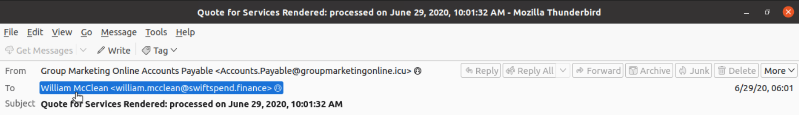

**Answer:** `William McClean`

### Step 2

Now I should identify the email address that was used by the adversary to send the phishing emails.
On the same header (and screenshot) as the previous question, I can also see the sender's email.

**Answer:** `Accounts.Payable@groupmarketingonline.icu`

### Step 3

Investigate the attachment in the email addressed to Zoe Duncan and find the root domain of the redirection URL found within the file.
So, after downloading the file in a virtual environment and opening on the browser, the html file redirected me to a very weird and long domain; however, there was the answer I nedded.

**Answer:** `kennaroads.buzz`

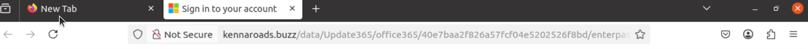

### Step 4

Which company is the login page impersonating?
Within the same web page from the previous question, we can see this page is impersonating Microsoft.

**Answer:** `Microsoft`

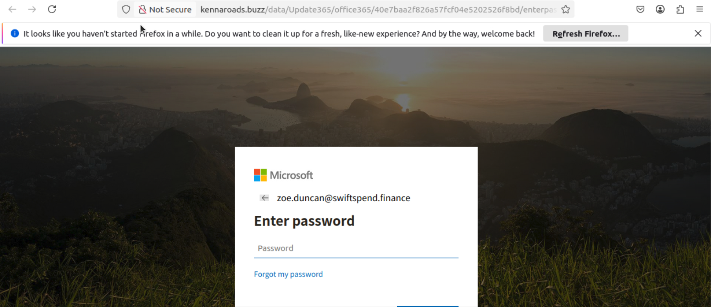

### Step 5

Now I need to check if the attacker left any files exposed on the same website.
If I navigate to the /data directory of the website (http://kennaroads.buzz/data/), I can see that there's an archive .ZIP file which, might just be what we are looking for. 

**Answer:** `Update365.zip`

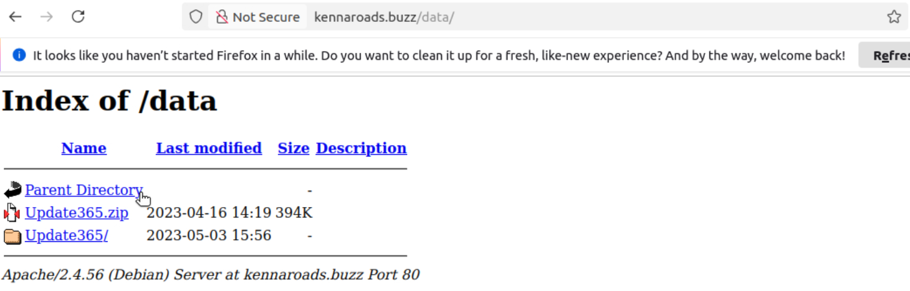

### Step 6

I must now sownload the phishing kit archive to my virtual environment and find out the SHA256 hash of the file.
So, by simply running "sha256sum Update365.zip", I have my answer.

**Answer:** `ba3c15267393419eb08c7b2652b8b6b39b406ef300ae8a18fee4d16b19ac9686`

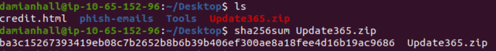

### Step 7

I need to keep investigating the file hash from the previous question, but now using VirusTotal. Aside from phishing, what other threat category is assigned to the ZIP archive?
By analyzing Virus Total results, we can determine this ZIP archive is assigned as a Trojan.

**Answer:** `Trojan`

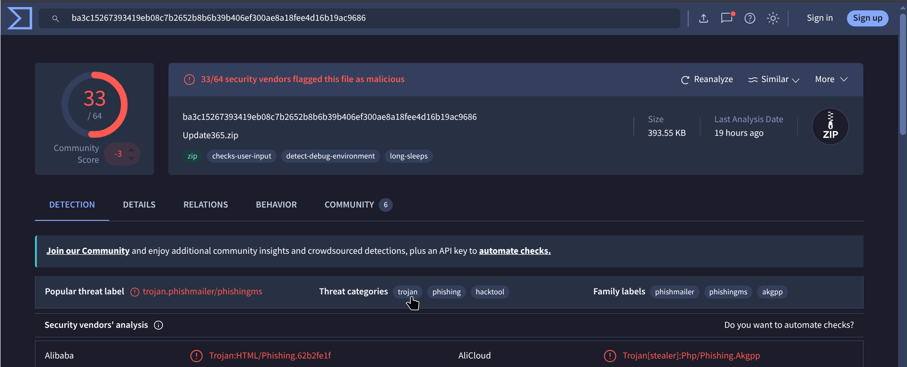

### Step 8

Keep investigating the VirusTotal Details page for the phishing kit and determine how many files are contained within the archive.
By scrolling down on the Details page, we find the Metadata section, providing us what we need.

**Answer:** `49`

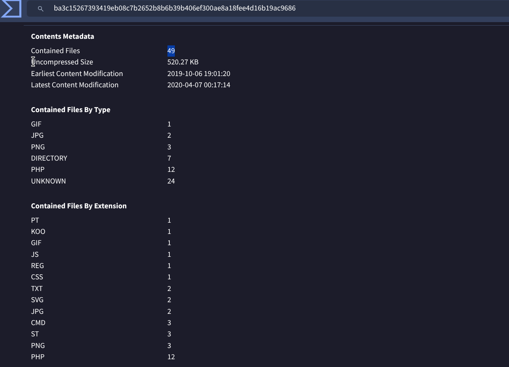

### Step 9 

Let’s see if the attacker has exposed any captured credentials. Now I should navigate to the /data/Update365/ directory and investigate the log file.What is the email address of the user who submitted their credentials more than once?
By analyzing the entire log file, I could identify one of the victims who have submitted their credentials more than once. 

**Answer:** `michael.ascot@swiftspend.finance`

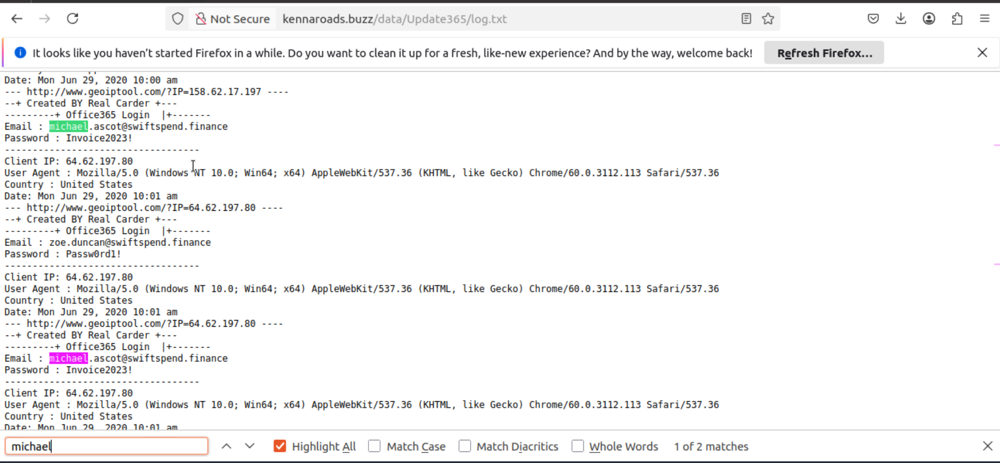

### Step 10

Now I have to extract the phishing kit archive, locate the submit.php file, and identify what email address is used by the adversary to collect compromised credentials.
By unziping the archive, I could find the 'submit.php' within subdirectories, and after analyzing the file a little deeper, I was able to find the adversary's email.

**Answer:** `m3npat@yandex.com`

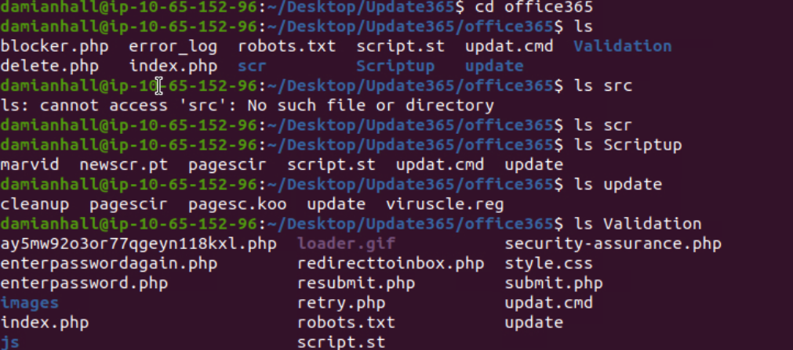
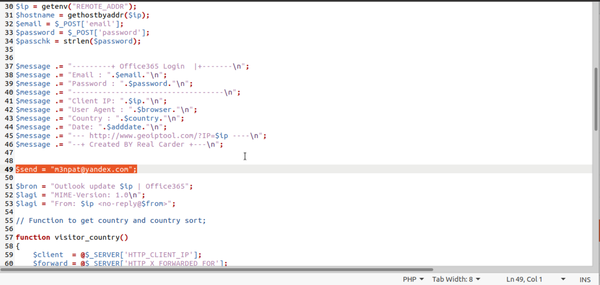

## Step 11


For the last step, I should return to the phishing URL(kennaroads.buzz) and locate the hidden flag.txt file.
After a game of try and error, I was able to find the hidden file running:
``` bash
curl -s http://kennaroads.buzz/data/Update365/office365/flag.txt
```
wich gave me the base64 enconded secret. Then by using CyberChef to decode the flag, im able to decrypt the message and get our last answer.

**Answer:** `THM{pl4y_w1th_th3_URL}`

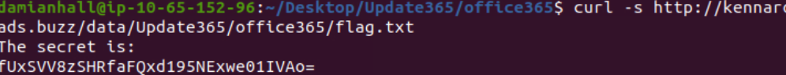
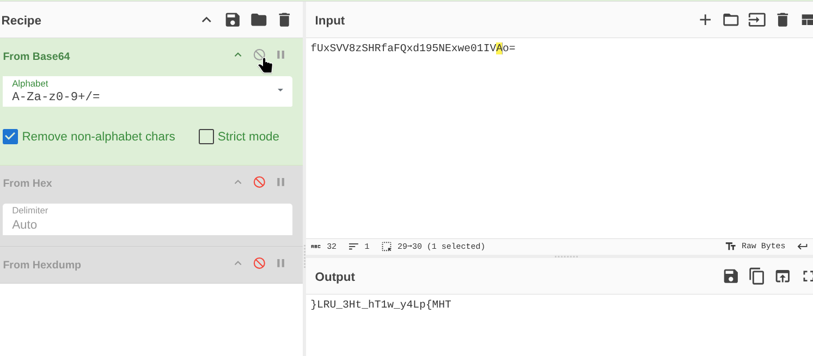

## Summary

As an IT/security investigator at SwiftSpend Financial, I analyzed a phishing campaign that targeted multiple employees. Key evidence included email samples, a redirected phishing URL, and a publicly accessible phishing kit hosted on kennaroads.buzz. The campaign impersonated Microsoft to harvest Office365 credentials. Artifacts and indicators discovered:

- Victim identified in mail corpus: `William McClean` (recipient of "Quote for Services Rendered").
- Attacker sender address observed: `Accounts.Payable@groupmarketingonline.icu`.
- Malicious redirection root domain discovered in attached HTML: `kennaroads.buzz`.
- Impersonated brand on login page: `Microsoft` (Office365).
- Exposed phishing kit archive at /data: `Update365.zip` (SHA256: ba3c15267393419eb08c7b2652b8b6b39b406ef300ae8a18fee4d16b19ac9686).
- VirusTotal classification: `Phishing and Trojan`.
- Archive contents: `49 files`.
- Captured credential evidence: logs show repeated submissions by `michael.ascot@swiftspend.finance`.
- Adversary collection endpoint: submit.php configured to email captured credentials to `m3npat@yandex.com`.
- Hidden flag/indicator retrieved at /data/Update365/office365/flag.txt; decoded value: `THM{pl4y_w1th_th3_URL}`.

Overall scope: multiple employees received the phishing message; at least one user (michael.ascot@swiftspend.finance) submitted credentials multiple times; the phishing infrastructure and kit were publicly accessible and reusable, indicating opportunistic adversary behavior and poor operational hygiene on the hosting side.

## Lessons Learned

- Enforce DMARC, DKIM, and SPF to reduce effective email spoofing.
- Sandbox or block HTML and ZIP attachments at the email gateway.
- Immediately reset credentials and invalidate sessions for suspected compromises.
- Continuously scan and monitor external domains and assets referencing your brand.
- Add extracted kit metadata (hash, filenames, submit.php address) to IOC repositories and hunt for matches.
- Require MFA (preferably hardware/FIDO2) and enforce adaptive access controls.
- Maintain and exercise a phishing incident response playbook covering containment to takedown.
- Report malicious infrastructure to hosting providers and registrars for takedown.
- Provide targeted user notifications and mandatory phishing awareness remediation.
- Harden authentication flows and implement conditional access to limit risky logins.

